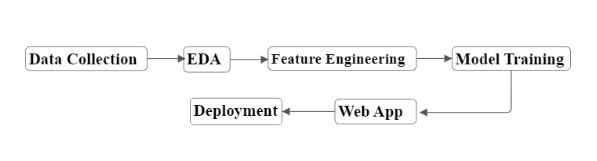

# AlgerianForestFire-Prediction-Using-MachineLearning

Applied Regression-(Linear,Elastic-net,Lasso,Ridge) and selected the model with best r2-score(Ridge) -- 0.98

# Dataset
The dataset includes 244 instances that regroup a data of two regions of Algeria.

https://archive.ics.uci.edu/dataset/547/algerian+forest+fires+dataset

# Dataset Characteristics
Multivariate

Subject Area
Biology

Associated Tasks
Classification, Regression

Feature Type
Real

# Instances
244

# Features
12

# Dataset Information (Additional Information)

The dataset includes 244 instances that regroup a data of two regions of Algeria,namely the Bejaia region located in the northeast of Algeria and the Sidi Bel-abbes region located in the northwest of Algeria.

122 instances for each region. 

The period from June 2012 to September 2012. 
The dataset includes 11 attribues and 1 output attribue (class)
The 244 instances have been classified into ‘fire’ (138 classes) and ‘not fire’ (106 classes) classes.

Has Missing Values?

No

# Introductory Paper
Predicting Forest Fire in Algeria Using Data Mining Techniques: Case Study of the Decision Tree Algorithm
By Faroudja Abid, N.Izeboudjen. 2020

Published in Ezziyyani M. (eds) Advanced Intelligent Systems for Sustainable Development (AI2SD’2019). Advances in Intelligent Systems and Computing

# Variable Information
1. Date : (DD/MM/YYYY) Day, month ('june' to 'september'), year (2012)
2. Temp : temperature noon (temperature max)  in Celsius degrees: 22 to 42
3. RH : Relative Humidity in %: 21 to 90 
4. Ws :Wind speed in km/h: 6 to 29 
5. Rain: total day in mm: 0 to 16.8
6. Fine Fuel Moisture Code (FFMC) index from the FWI system: 28.6 
to 92.5.

7. Duff Moisture Code (DMC) index from the FWI system: 1.1 to 65.9 
8. Drought Code (DC) index from the FWI system:  7 to 220.4
9. Initial Spread Index (ISI) index from the FWI system: 0 to 18.5 
10. Buildup Index (BUI) index from the FWI system: 1.1 to 68
11. Fire Weather Index (FWI) Index: 0 to 31.1
12. Classes: two classes, namely   “Fire” and “not Fire”

